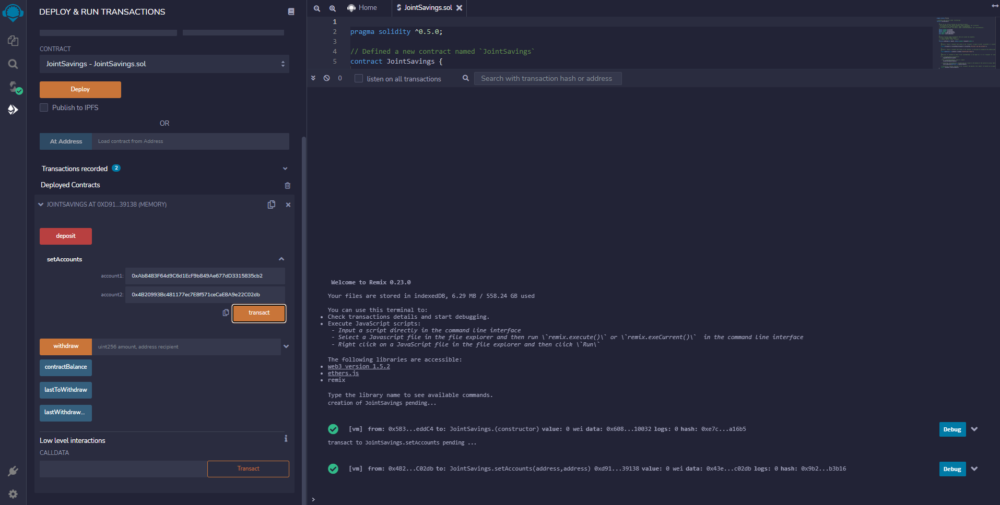
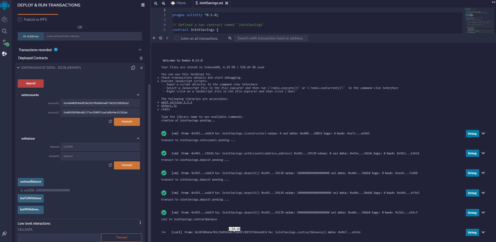
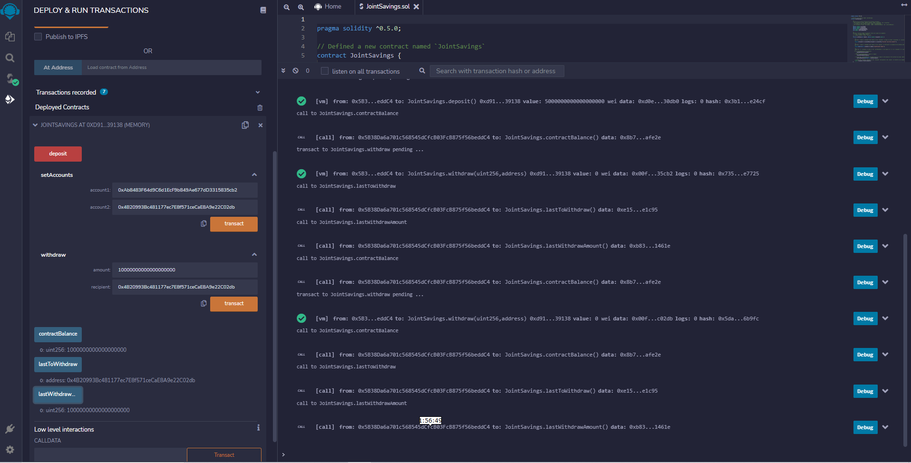
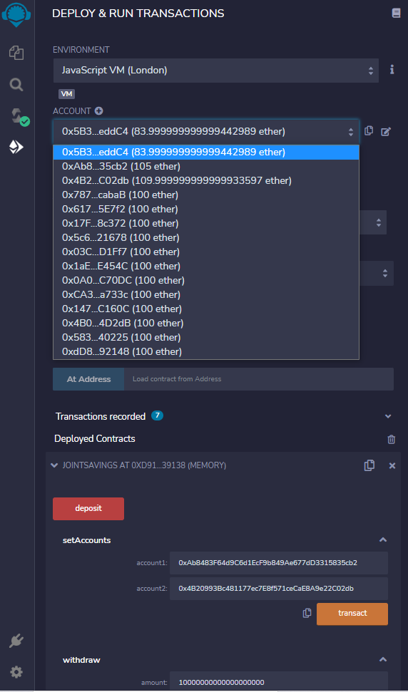

Solidity "Joint Savings Account"

### Background

To automate the creation of joint savings accounts,Solidity smart contract that accepts two user addresses. These addresses will be able to control a joint savings account. The smart contract will use ether management functions to implement a financial institution’s requirements for providing the features of the joint savings account. These features will consist of the ability to deposit and withdraw funds from the account.

### What's Being Created

* The completed Solidity `JointSavings` smart contract.

* A folder named `Execution_Results` that contains at least eight images. These images confirms that the deposit and withdrawal transactions, which are designed to test the `JointSavings` functionality in the JavaScript VM, worked as expected.

#### Step 1: Created a Joint Savings Account Contract in Solidity
Joint Savings Account
---------------------

To automate the creation of joint savings accounts, created a solidity smart contract that accepts two user addresses that are then able to control a joint savings account.Smart contract uses ether management functions to implement various requirements from the financial institution to provide the features of the joint savings account.

Thefile for this contains a `pragma` for solidity version `5.0.0`.
following steps were accomplished:

1. Created and worked within a local blockchain development environment using the JavaScript VM provided by the Remix IDE.

2. Scripted and deployed a **JointSavings** smart contract.

3. Interacted with deployed smart contract to transfer and withdraw funds.
#### Step 2: Interaction with Deployed Smart Contract

After Deploying the contract, it’s time to test its functionality! After each step, captured a screenshot of the execution, and then saved it in a folder named `Execution_Results`. Shared this folder with files.

To show interaction with deployed smart contract, completed the following steps:

1. Used the `setAccounts` function to define the authorized Ethereum address that will be able to withdraw funds from your contract.

2. Tested the deposit functionality of smart contract by sending the following amounts of ether. After transactions, used the `contractBalance` function to verify that the funds were added to the contract:
    * Transaction 1: Send 1 ether as wei.
    * Transaction 2: Send 10 ether as wei.
    * Transaction 3: Send 5 ether.

3. After successfully depositing funds into contract, tested the contract’s withdrawal functionality by 

    * Withdrawing 5 ether into `accountOne`.
    
    * Withdrawing 10 ether into `accountTwo`. 
    
    * After each transaction, used the `contractBalance` function to verify that the funds were withdrawn from   contract. 
    * Used the `lastToWithdraw` and `lastWithdrawAmount` functions to verify that the address and amount were correct.
    

---